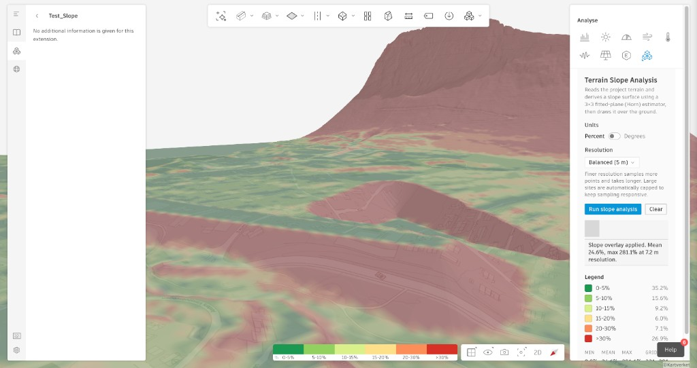
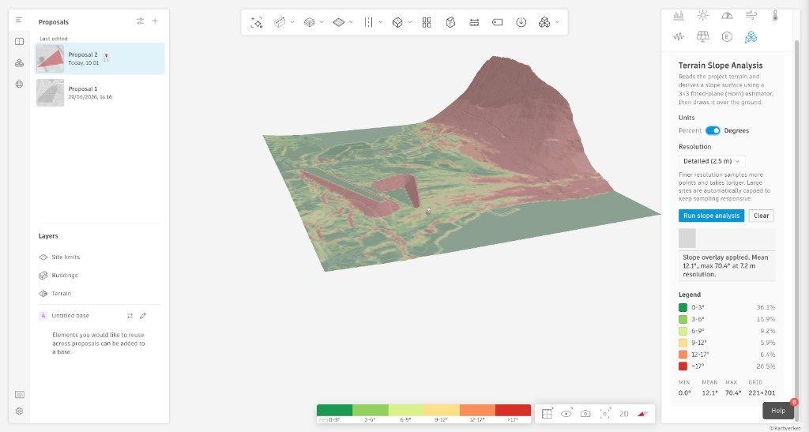

# Terrain Slope Analysis

An [Autodesk Forma](https://app.autodeskforma.com) Site Design embedded-view
extension that reads the project terrain and turns it into a **slope analysis**
surface — drawn directly over the ground with a classified color legend and an
interactive colorbar.

It answers a simple site-planning question fast: _where is the ground flat
enough to build on, and where is it too steep?_



> Slope shown in **percent** over a hilly site. The overlay grades from green
> (flat, buildable) to red (steep), with a live legend and statistics.



> The same analysis in **degrees**, here on a flatter proposal with buildings.
> Min / mean / max and the sampling grid size are reported beneath the legend.

## Features

- **One-click slope surface** painted over the terrain as a ground texture.
- **Percent or degrees**, toggled instantly without re-sampling.
- **Selectable resolution** (Fast → Fine); large sites are auto-capped so
  sampling stays responsive.
- **Classified legend** with the share of the site in each slope band, plus
  min / mean / max and grid dimensions.
- **Interactive colorbar** in the scene matching the legend.
- **Preview mode** — the panel renders in a normal browser tab outside Forma for
  fast UI iteration.

## How it works

1. Reads the terrain bounding box with `Forma.terrain.getBbox()`.
2. Samples elevations on a regular grid with `Forma.terrain.getElevationAt()`
   (bounded concurrency; the grid is capped for large sites).
3. Computes slope per cell with **Horn's method** — a Sobel-weighted central
   difference that fits a plane to each cell's eight neighbours. This is the
   "fit a plane to the 3×3 window" approach from Joseph Berry's
   _[Characterizing Micro-Terrain Features](http://www.innovativegis.com/basis/Senarios/Materials/MC_learner/MA_book/Topic11/Topic11.htm)_,
   and the same estimator ArcGIS / QGIS use. It is more stable than averaging
   the eight individual neighbour slopes.
4. Classifies slope into buildability bands and paints a canvas ground texture
   via `Forma.terrain.groundTexture.add()`.
5. Adds the legend colorbar via `Forma.colorbar.add()`.

For each grid cell, given elevations `z1..z9` in the 3×3 window and cell size `d`
(meters):

```
dz/dx = (z3 + 2·z6 + z9 − (z1 + 2·z4 + z7)) / (8·d)
dz/dy = (z7 + 2·z8 + z9 − (z1 + 2·z2 + z3)) / (8·d)
slope% = sqrt((dz/dx)² + (dz/dy)²) · 100
slope° = atan(sqrt((dz/dx)² + (dz/dy)²)) · 180 / π
```

Edge cells replicate their nearest in-bounds neighbour. All elevation/geometry
values from the SDK are in **meters**, regardless of the UI's presentation unit.

The slope overlay and colorbar are **transient render output** (not durable
element-system content), which is the correct choice for an analysis layer.

## Using it in Forma

1. Open a Forma project and open the **Terrain Slope Analysis** panel from the
   right-hand **Analyse** menu.
2. Choose **Units** (percent or degrees) and a **Resolution**.
3. Click **Run slope analysis**. The overlay, legend, and colorbar appear.
4. Click **Clear** to remove the overlay.

Live URL:
`https://andresdsilva-adsk.github.io/extensions-showcase/slope-analysis/`

## Local development

```bash
cd slope-analysis
npm install
npm run dev      # http://localhost:5173/
```

Outside the Forma host the panel runs in **preview mode** — the SDK is only
imported when Forma host query parameters are present, so the UI is testable in a
plain browser tab and host-only actions stay disabled until the SDK loads.

To test inside Forma, install Forma's
[local testing extension](https://aps.autodesk.com/en/docs/forma/v1/embedded-views/getting-started/#local-testing-extension)
and point it at your dev server URL.

## Build & verify

```bash
npm run build       # production bundle in dist/ (relative base, subpath-safe)
npm run typecheck   # tsc --noEmit
node scripts/verify-slope.mjs   # checks the Horn estimator vs known surfaces
```

The math check validates the estimator against analytically-known surfaces (flat
plane, single-axis 20% plane, diagonal 50% plane, and the degrees conversion).

## Project structure

```
src/
  slope/compute.ts   Pure slope math + classification + canvas rendering
  forma/client.ts    Preview-safe SDK loading, terrain sampling, overlays
  ui/weave.tsx       Weave web-component React wrappers (CDN)
  App.tsx            Panel UI and analysis orchestration
docs/                Screenshots used in this README
scripts/             Standalone math verification
```

## Tech notes

- **Stack:** Vite + React + TypeScript, `forma-embedded-view-sdk/auto`.
- **UI:** Weave design-system web components loaded from the public Forma CDN, so
  the build does not depend on the Autodesk internal npm registry.
- The pure slope math in `src/slope/compute.ts` has no SDK coupling and is unit
  testable in isolation.
